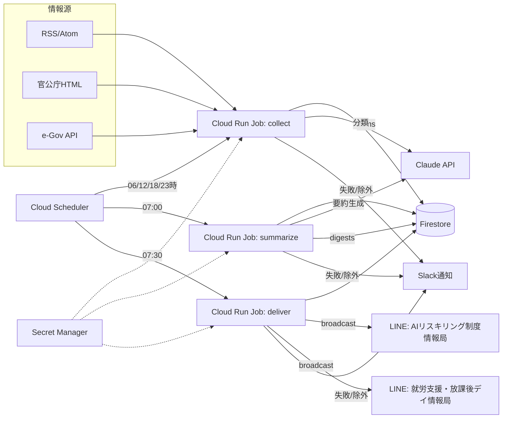

# 詳細設計書 ― 制度改正ウォッチ & 公式LINE毎朝配信システム

| 項目 | 内容 |
|---|---|
| 文書バージョン | 1.1 |
| 作成日 | 2026-09-12 |
| 関連文書 | 01_要件定義書.md / 02_タスク管理書.md |

---

## 1. 設計方針

1. **一次情報を唯一の根拠にする。** AI には収集済みの記事本文と URL だけを渡し、外部検索はさせない。出典は入力に含まれる URL 以外を許さず、プログラムで検証する。
2. **パイプラインを 3 ジョブに分離する。** `collect`(収集) → `summarize`(要約) → `deliver`(配信)。各ジョブは独立して再実行でき、状態は Firestore に永続化する。
3. **冪等性。** すべてのジョブは同じ入力で何度実行しても副作用が 1 回分にとどまる。
4. **設定はコードから分離する。** ソース、チャネル、閾値、スケジュールは YAML と環境変数で管理する。
5. **失敗は黙らせない。** 取得失敗・除外・配信失敗はすべて記録し、通知する。

---

## 2. システム構成



### 2.1 コンポーネント

| コンポーネント | 技術 | 役割 |
|---|---|---|
| ジョブ実行 | Cloud Run Jobs(コンテナ) | 3 ジョブを同一イメージ・異なる引数で実行 |
| スケジューラ | Cloud Scheduler(JST 指定) | ジョブ起動 |
| データストア | Firestore(Native) | items / digests / deliveries / runs / source_state |
| 秘密情報 | Secret Manager | LINE トークン ×2、Anthropic API キー、Slack Webhook |
| AI | Anthropic Claude `claude-opus-5` | 分類と要約(構造化出力) |
| 配信 | LINE Messaging API `POST /v2/bot/message/broadcast` | 全友だち配信 |
| 通知 | Slack Incoming Webhook | 運用通知 |
| IaC | Terraform | 基盤の再現 |
| 言語 | TypeScript(Node.js 22, pnpm) | 実装 |

代替基盤: AWS の場合は EventBridge Scheduler + ECS/Fargate タスク(または Lambda)+ DynamoDB + Secrets Manager に 1 対 1 で置換可能。アプリ側はリポジトリ層の差し替えのみ。

---

## 3. リポジトリ構成

```
.
├── config/
│   ├── channels.yaml          # チャネル定義(LINE アカウント、閾値、件数上限)
│   └── sources/
│       ├── common.yaml
│       ├── ai_reskill.yaml
│       └── welfare.yaml
├── src/
│   ├── cli.ts                 # エントリ: collect | summarize | deliver
│   ├── config/                # YAML スキーマ(zod)と読込
│   ├── fetchers/              # rss.ts / html.ts / egov.ts / extract.ts
│   ├── pipeline/
│   │   ├── collect.ts
│   │   ├── classify.ts
│   │   ├── summarize.ts
│   │   ├── quality-gate.ts
│   │   └── deliver.ts
│   ├── ai/                    # client.ts / prompts/ / schemas.ts
│   ├── line/                  # client.ts / format.ts
│   ├── store/                 # firestore repos
│   ├── notify/                # slack.ts
│   └── util/                  # http(rate limit, robots), hash, time
├── infra/terraform/
├── test/
├── Dockerfile
└── docs/
```

---

## 4. 設定ファイル設計

### 4.1 `config/channels.yaml`

```yaml
channels:
  - id: ai_reskill
    name: AIリスキリング制度情報局
    lineTokenSecret: projects/${PROJECT}/secrets/line-token-ai-reskill/versions/latest
    topics: >
      人材開発支援助成金、教育訓練給付、リスキリング施策、AI事業者ガイドライン、
      AI関連法制、デジタル人材育成、関連補助金
    relevanceThreshold: 0.6      # 0..1
    maxItems: 7
    minItems: 3
    maxChars: 1500
    sendWhenEmpty: true          # 0件でも「新着なし」を配信(障害との区別のため)
    deliverAt: "07:30"           # JST
  - id: welfare
    name: 就労支援、放課後デイ情報局
    lineTokenSecret: projects/${PROJECT}/secrets/line-token-welfare/versions/latest
    topics: >
      障害福祉サービス等報酬改定、指定基準・運営基準、就労移行支援、就労継続支援A型・B型、
      就労選択支援、児童発達支援、放課後等デイサービス、障害者総合支援法、児童福祉法
    relevanceThreshold: 0.6
    maxItems: 7
    minItems: 3
    maxChars: 1500
    sendWhenEmpty: true
    deliverAt: "07:30"
```

自治体ソースの例(`config/sources/municipal.yaml`):

```yaml
sources:
  - id: osaka_pref_shogai
    name: 大阪府 障がい福祉室 事業者向けお知らせ
    type: html
    url: https://www.pref.osaka.lg.jp/...      # 登録時に確定
    channels: [welfare]
    priority: medium
    region: 大阪府                              # 分類で地域を明示するために使用
    html:
      itemSelector: "div.news li a"
    enabled: true
```

対象自治体は要件定義書 §5.4 の 7 都府県。`region` を持つソースから検知したアイテムは、AI 分類で `region` フィールドに引き継ぎ、まとめの `対象` に地域名を含める。

### 4.2 `config/sources/*.yaml`

```yaml
sources:
  - id: mhlw_news_rss
    name: 厚生労働省 新着情報
    type: rss
    url: https://www.mhlw.go.jp/stf/news.rdf
    channels: [ai_reskill, welfare]
    priority: high
    enabled: true

  - id: mhlw_shogai_hoshu
    name: 厚労省 障害福祉サービス等報酬改定
    type: html
    url: https://www.mhlw.go.jp/stf/newpage_00000.html   # 実URLは登録時に確定
    channels: [welfare]
    priority: high
    html:
      itemSelector: "ul.m-listLink li a"       # 新着リンク一覧
      titleFrom: text
      hrefFrom: href
      dateSelector: null                         # 無ければ検知日時を使う
    enabled: true

  - id: egov_laws
    type: egov
    channels: [ai_reskill, welfare]
    egov:
      endpoint: https://laws.e-gov.go.jp/api/2/law_revisions
      lookbackDays: 2
    enabled: true
```

スキーマは zod で定義し、起動時に検証。未知のフィールドはエラー。

---

## 5. データモデル(Firestore)

### 5.1 `items`(収集アイテム)
| フィールド | 型 | 説明 |
|---|---|---|
| `id` | string | `sha256(canonicalUrl)` の先頭 40 桁 |
| `sourceId` | string | ソース ID |
| `canonicalUrl` | string | 正規化 URL(UTM 除去、末尾スラッシュ統一、http→https) |
| `title` | string | 見出し |
| `publishedAt` | timestamp \| null | 記事の公開日(取得できた場合) |
| `detectedAt` | timestamp | 初検知日時(更新時も据え置く) |
| `updatedAt` | timestamp | 最終更新日時(本文ハッシュが変わった時刻)。更新記事の集約に使う |
| `contentHash` | string | 本文の sha256(更新検知用) |
| `contentText` | string | 抽出本文(最大 6,000 文字) |
| `contentType` | `html` \| `pdf` | |
| `classification` | map \| null | §7.1 の出力 |
| `region` | string \| null | ソース定義の `region`(自治体情報のみ) |
| `classifiedAt` | timestamp \| null | |
| `digestedIn` | string[] | 使用されたダイジェスト ID |
| `expiresAt` | timestamp | TTL(90 日) |

### 5.2 `digests`(生成済みまとめ)
| フィールド | 型 | 説明 |
|---|---|---|
| `id` | string | `${channelId}_${YYYY-MM-DD}` |
| `channelId` | string | |
| `date` | string | JST 日付 |
| `entries` | array | §7.2 の出力から品質ゲート通過分 |
| `excluded` | array | 除外項目と理由 |
| `messageText` | string | 整形済み LINE 本文 |
| `status` | `generated` \| `approved` \| `delivered` \| `skipped` \| `failed` | |
| `model` | string | 使用モデル ID |
| `prompt` / `rawResponse` | string | 監査用 |
| `usage` | map | トークン数 |
| `createdAt` | timestamp | |

### 5.3 `deliveries`
| フィールド | 型 | 説明 |
|---|---|---|
| `id` | string | `${channelId}_${YYYY-MM-DD}`(冪等キー) |
| `digestId` | string | |
| `lineRequestId` | string | LINE の `X-Line-Request-Id` |
| `retryKey` | string | LINE の `X-Line-Retry-Key`(UUID v4) |
| `status` | `sent` \| `failed` | |
| `sentAt` | timestamp | |
| `error` | string \| null | |

### 5.4 `source_state`
| フィールド | 型 | 説明 |
|---|---|---|
| `sourceId` | string | |
| `lastFetchedAt` | timestamp | |
| `lastSuccessAt` | timestamp | |
| `consecutiveFailures` | number | 3 以上で警告 |
| `lastCandidateCount` | number | 直近の巡回で一覧から取れた候補リンク数 |
| `consecutiveEmpty` | number | 候補 0 件が続いた回数。4 以上(= まる 1 日)でセレクタ失効として警告し、「新着なし」文面の確認済みソース数からも除外する |
| `etag` / `lastModified` | string | 条件付き GET 用 |
| `lastError` | string \| null | |

### 5.5 `runs`
ジョブ 1 実行 = 1 ドキュメント。`job`, `startedAt`, `finishedAt`, `status`, `counts{fetched,new,classified,excluded,sent}`, `error`。

---

## 6. ジョブ詳細

### 6.1 `collect`(06:00 / 12:00 / 18:00 / 23:00 JST)

```
for source in enabledSources (ホストごとに直列、ホスト間は並列 ≤ 4):
  1. robots.txt 確認(不許可なら skip + 警告)
  2. 条件付き GET(ETag / If-Modified-Since)。304 なら終了
  3. type 別に「候補リンク一覧」を抽出
       rss  : feed.items → {title, link, pubDate}
       html : itemSelector で <a> を列挙 → {title, href}
       egov : API レスポンス → {law title, url, revisionDate}
  4. 各候補を URL 正規化 → items に存在しなければ新規
  5. 新規のみ本文取得(HTML: Readability / PDF: pdf-parse)、6,000 文字で切詰
  6. contentHash が既存と異なる既知 URL は「更新」として classification をリセット
  7. items 書込、source_state 更新
  8. 失敗時: consecutiveFailures++、3 回目で Slack 警告
classify(未分類 items) を実行(§7.1)
```

- 既知 URL の更新検知は 2 段構え。
  1. 一覧側の見出し・掲載日が変わったものを取り直す(安価な入口)。
  2. それに加えて 1 巡回あたり `RECHECK_PER_SOURCE` 件(既定 5)だけ、
     最後に確認してから最も時間が経った既知アイテムの本文を取り直す。
     官公庁では「リンク文字列は同じまま本文に Q&A 第3報が追記される」更新が主流で、
     1 だけでは永久に検知できないため。全件取り直すと NFR-07 の 2 秒間隔と
     掛け算になって巡回が終わらないので件数で上限を設ける。
- 同じ URL が複数ソースの一覧に載ることがある(自治体が国の通知を転載)。
  items は URL 単位で一意なので、**初検知したソースの `sourceId` / `region` / `title` を
  後から来た別ソースで上書きしない**。上書きすると全国一律の通知が地域限定に見え、
  さらに「国の転載」と誤判定されて国の通知そのものが落ちる。
- ホスト別レート制限: 同一ホストへは 2 秒間隔。タイムアウト 20 秒、リトライ 2 回。
- User-Agent: `SeidoWatchBot/1.0 (+mailto:ops@example.com)`
- 1 ソースあたりの新規上限: 50 件(初回登録時の大量取込を防ぐ。初回は `--bootstrap` で 0 件扱いにして「今日以降」だけを対象にする)。

### 6.2 `summarize`(07:00 JST)

```
for channel in channels:
  1. 対象 = A ∪ B ∪ C
       A(新着)= items where detectedAt in [前日 07:00, 当日 07:00) JST
       B(更新)= items where updatedAt  in [前日 07:00, 当日 07:00) JST
                 かつ detectedAt < ウィンドウ開始
                 かつ classifiedAt >= updatedAt(更新後に再分類済み)
                 かつ 直近 7 日間このチャネルで配信していない
       C(繰り越し)= items where detectedAt in [ウィンドウ開始 - 3 日, ウィンドウ開始)
                 かつ このチャネルの digest に一度も載っていない
       ※ B の updatedAt は 14 日さかのぼって探す。7 日ルールは再掲を「遅らせる」もので
          あって「捨てる」ものではないため、7 日経った日に改めて候補へ戻す必要がある。
       ※ 未分類(classification === null)のアイテムがウィンドウ内に 1 件でもあるとき、
          対象 0 件でも「新着なし」とは配信せず status='failed' にする。
          AI 分類が終日失敗した日に「監視は正常、新着なし」と伝えてしまうため。
       ※ detectedAt は初検知時刻のまま据え置かれるため、A だけでは
          「更新は検知したが誰にも届かない」状態になる(FR-02)。
          B の 3 条件は、日付や訪問者数だけが変わるページの毎日再掲を防ぐガード。
       ※ C が無いと、件数上限(20 件)・文字数上限・分類の遅れで本文に載らなかった
          アイテムは digestedIn が付かないまま翌日のウィンドウから外れ、
          二度と配信されない。報酬改定の公表日のように 1 日に大量に出る日ほど落ちる。
     さらに共通の条件:
        classification.channels contains channel.id
        and classification.relevance >= channel.relevanceThreshold
        and digestId not in digestedIn
  2. 重要度 desc, relevance desc で並べ、上位 20 件を AI 入力にする
  3. 0 件 → sendWhenEmpty=true(初期値)なら「新着なし」文面(§9.1)で digest を生成し status=generated。
             false ならば status=skipped
  4. AI にダイジェスト生成を依頼(§7.2)
  5. 品質ゲート(§8)を通過した entries で messageText を整形(§9)
  6. digests 書込、items.digestedIn 更新
  7. 除外があれば Slack に理由付きで通知
```

### 6.3 `deliver`(07:30 JST)

```
for channel in channels:
  1. digest = digests[`${channel.id}_${today}`]
  2. status が generated/approved 以外 → skip(ログ)
  3. deliveries に同 ID が存在し status=sent → skip(冪等)
  4. retryKey = 既存 deliveries.retryKey か 新規 UUID
  5. LINE broadcast(X-Line-Retry-Key: retryKey)
  6. 成功: deliveries.status=sent, digest.status=delivered
     失敗: 指数バックオフで最大 3 回 → それでも失敗なら Slack 通知、status=failed
```

承認モード(任意拡張): `channel.requireApproval=true` のとき `generated` のままでは配信せず、運用者が CLI または管理画面で `approved` にした digest のみ配信する。

---

## 7. AI 設計

### 7.1 分類(classify)

- モデル: `claude-opus-5`、adaptive thinking、`output_config.effort: "low"`(短い判定タスクのため)
- 1 リクエストで最大 20 件をまとめて判定(トークン節約)。
- 入力: 各アイテムの `id / title / canonicalUrl / contentText(先頭 1,500 文字)` と、全チャネルの `topics`
- 出力(構造化出力 `output_config.format`、JSON Schema):

```json
{
  "type": "object",
  "properties": {
    "results": {
      "type": "array",
      "items": {
        "type": "object",
        "properties": {
          "id": { "type": "string" },
          "channels": { "type": "array", "items": { "enum": ["ai_reskill", "welfare"] } },
          "relevance": { "type": "number", "minimum": 0, "maximum": 1 },
          "importance": { "enum": ["high", "medium", "low"] },
          "kind": { "enum": ["law_amendment", "fee_revision", "notice", "public_comment", "budget", "event", "other"] },
          "isDuplicateOfNational": { "type": "boolean", "description": "自治体ページが国の通知を転載しただけの場合 true" },
          "effectiveDate": { "type": ["string", "null"], "description": "YYYY-MM-DD。原文に明記がある場合のみ" },
          "deadline": { "type": ["string", "null"] },
          "reason": { "type": "string", "maxLength": 200 }
        },
        "required": ["id", "channels", "relevance", "importance", "kind", "isDuplicateOfNational", "effectiveDate", "deadline", "reason"],
        "additionalProperties": false
      }
    }
  },
  "required": ["results"],
  "additionalProperties": false
}
```

システムプロンプト要点:
- 「与えられた本文に書かれている事実だけで判断する。日付は本文に明記されている場合のみ埋め、推測しない」
- 「イベント告知や一般ニュースは relevance を低くする。制度・報酬・基準・給付要件・期限に直接影響するものを高くする」
- 「`reason` は運用者が判定を監査するための一文」
- 「入力に `region` があるアイテムは自治体情報。国の通知をそのまま転載しただけなら `isDuplicateOfNational=true` とし、summarize では国側のアイテムを優先する」

### 7.2 ダイジェスト生成(summarize)

- モデル: `claude-opus-5`、adaptive thinking、`output_config.effort: "medium"`、ストリーミングで受信し `finalMessage()` を使用
- 入力: チャネル情報(名前・topics・maxItems・minItems・maxChars)、当日の日付、対象アイテム(最大 20 件: `id / title / canonicalUrl / kind / importance / effectiveDate / deadline / contentText(先頭 3,000 文字)`)
- 出力(構造化出力):

```json
{
  "type": "object",
  "properties": {
    "entries": {
      "type": "array",
      "items": {
        "type": "object",
        "properties": {
          "itemId": { "type": "string" },
          "headline": { "type": "string", "maxLength": 60 },
          "summary": { "type": "string", "maxLength": 140 },
          "affected": { "type": "string", "maxLength": 40 },
          "dateNote": { "type": ["string", "null"], "maxLength": 40 },
          "sourceUrl": { "type": "string" },
          "importance": { "enum": ["high", "medium", "low"] }
        },
        "required": ["itemId", "headline", "summary", "affected", "dateNote", "sourceUrl", "importance"],
        "additionalProperties": false
      }
    },
    "omittedCount": { "type": "integer", "minimum": 0 }
  },
  "required": ["entries", "omittedCount"],
  "additionalProperties": false
}
```

システムプロンプト要点:
- 「読者は現場責任者。毎朝 1 分で読める分量にする。`minItems`〜`maxItems` 件に絞り、重要度順に並べる」
- 「`sourceUrl` は入力アイテムの `canonicalUrl` をそのまま使う。入力にない URL を作らない」
- 「`summary` は本文に書かれている事実のみ。数値・日付は原文どおり。判断や助言は書かない」
- 「同じ制度に関する複数記事は 1 項目に統合し、最も一次情報に近い URL を出典にする」
- 「`region` を持つアイテムは `affected` に地域名を含める(例: 大阪府内の放課後等デイ)」
- 「入力が 0 件のときは entries を空にする」

### 7.3 API 呼び出し(TypeScript 例)

```ts
import Anthropic from "@anthropic-ai/sdk";

const client = new Anthropic(); // ANTHROPIC_API_KEY は Secret Manager から環境変数へ注入

const stream = client.messages.stream({
  model: "claude-opus-5",
  max_tokens: 16000,
  thinking: { type: "adaptive" },
  output_config: {
    effort: "medium",
    format: { type: "json_schema", schema: DIGEST_SCHEMA },
  },
  system: DIGEST_SYSTEM_PROMPT,
  messages: [{ role: "user", content: JSON.stringify(digestInput) }],
});
const message = await stream.finalMessage();
if (message.stop_reason !== "end_turn") throw new Error(`unexpected stop: ${message.stop_reason}`);
const parsed = DigestSchema.parse(JSON.parse(textOf(message))); // zod で二重検証
```

- 失敗時: `RateLimitError` / 5xx / 接続エラーはリトライ(SDK 既定 2 回 + アプリ側 1 回)。`400` は即失敗として通知。
- `stop_reason` が `refusal` または `max_tokens` の場合は失敗扱い。
- プロンプトキャッシュ: system プロンプトとスキーマは固定文字列とし、日付や入力データは `messages` 側に置く(キャッシュヒット率を上げる)。
- コスト目安: 1 日あたり分類 4 回 × 約 10K トークン + 要約 2 回 × 約 30K トークン ≈ 10 万トークン/日。月額で概ね数百〜千数百円。

---

## 8. 品質ゲート(quality-gate)

配信前に **すべて** 通過する必要がある。失敗した項目は `digest.excluded` に理由付きで記録し、Slack へ通知する。

| # | チェック | 失敗時 |
|---|---|---|
| Q1 | `sourceUrl` が入力アイテムの `canonicalUrl` 集合に含まれる | 項目除外 |
| Q2 | `sourceUrl` に HEAD/GET して 2xx or 3xx(タイムアウト 10 秒、1 回リトライ) | 項目除外 |
| Q3 | `itemId` が実在し、`sourceUrl` と一致する | 項目除外 |
| Q4 | `headline` `summary` `sourceUrl` が空でない | 項目除外 |
| Q4a | `affected` は空でもよい | 除外しない。整形時に「対象:」行ごと省略する(原文から読み取れない対象を AI に推測させないため。NFR-02) |
| Q5 | 禁則語(「〜すべき」「おすすめ」など助言・断定表現)を含まない | 項目除外 |
| Q6 | 項目数が 0 | 「新着なし」文面(§9.1)に差し替えて配信(sendWhenEmpty=true)。1〜`minItems` 未満なら、その件数で配信する |
| Q6a | 項目数が `maxItems` 超 | 重要度の高い順に `maxItems` 件へ切り、溢れた分は「その他 N 件」に合算する。AI の出力件数を信用せずコード側で強制する(FR-07) |
| Q9 | 自治体由来(`region` を持つソース)の項目 | `affected` に都府県名が無ければプログラムが補記する。除外はしない(地域名は設定由来の事実であり、AI の推測ではない。FR-18) |
| Q7 | 整形後 `messageText` が `maxChars` 以下、かつ LINE 上限 5,000 文字以下 | 下位項目から削って再整形。最小件数を割る場合は失敗通知 |
| Q8 | 同一 `sourceUrl` の重複 | 後続を除外 |

---

## 9. LINE メッセージ整形

- メッセージタイプ: `text` 1 通(Flex Message は将来検討。テキストの方が通知欄でも読め、LINE の URL 自動リンクが効く)。
- テンプレート:

```
【本日の制度・法改正まとめ】{M}/{D}({曜})
{channel.name}

■{n}. {【重要】 if high}{headline}
　{summary}
　対象: {affected}
　{dateNote が有れば}{dateNote}
　出典: {sourceUrl}

(項目を繰り返し。項目間は空行)

{omittedCount>0 なら}その他の新着 {omittedCount} 件は管理画面で確認できます。

※本まとめはAIが公的情報を要約したものです。正確な内容は必ず出典をご確認ください。
```

### 9.1 新着なし文面

```
【本日の制度・法改正まとめ】{M}/{D}({曜})
{channel.name}

本日の新着はありません。
(本日 {最終巡回時刻} 時点で {巡回成功ソース数} ソースを確認しました)

※この配信が届かない日はシステム障害の可能性があります。管理者へご連絡ください。
```

- 「エラーで配信できなかった日」と「新着が無かった日」を受信者が区別できるよう、0 件でも必ず配信する。
- 巡回成功ソース数は当日の `runs`(無ければ `source_state`)から算出する。巡回失敗が 1 件以上あれば
  `(本日 {時刻} 時点で {N} ソース中 {M} ソースを確認しました)` と表示し、運用者には Slack で失敗ソースを通知する。

### 9.2 送信

- 送信 API: `POST https://api.line.me/v2/bot/message/broadcast`
  - ヘッダ: `Authorization: Bearer {token}`, `X-Line-Retry-Key: {uuid}`, `Content-Type: application/json`
  - ボディ: `{ "messages": [{ "type": "text", "text": messageText }] }`
- レスポンス `X-Line-Request-Id` を `deliveries` に保存。
- 429/5xx はバックオフ再送(同じ Retry-Key を使うことで LINE 側で重複排除される)。

---

## 10. スケジュール(Cloud Scheduler, タイムゾーン `Asia/Tokyo`)

| ジョブ | cron | 備考 |
|---|---|---|
| collect | `0 6,12,18,23 * * *` | 4 回/日 |
| summarize | `0 7 * * *` | 直近 24 時間分 |
| deliver | `30 7 * * *` | summarize 失敗時は digest 無しで skip、Slack 通知 |

各ジョブのタイムアウト: collect 20 分、summarize 10 分、deliver 5 分。Scheduler のリトライ: 3 回。

---

## 11. セキュリティ

- Secret Manager から実行時に環境変数へ注入(Cloud Run Jobs の secret 参照機能)。ログに値を出さないためロガーに `redact` 設定。
- サービスアカウント権限: Firestore 読み書き、Secret Manager アクセサ、Logging 書込のみ。
- 外部アクセス先はソース YAML に列挙されたホストと `api.line.me` `api.anthropic.com` `hooks.slack.com` のみ(egress をポリシーで制限可能)。
- キーローテーション手順を Runbook に記載(LINE トークン再発行 → Secret 新バージョン → ジョブは次回実行から自動反映)。

---

## 12. 観測性・運用

- ログ: JSON 構造化(`job`, `runId`, `sourceId`, `channelId`, `count`, `durationMs`, `error`)。
- メトリクス(Cloud Monitoring): ジョブ成功/失敗、新着件数、除外件数、LINE 送信件数、AI トークン使用量。
- アラート:
  - deliver 失敗 → Slack(即時)
  - collect でソース連続失敗 3 回 → Slack(警告)
  - 07:45 時点で当日 deliveries が無い → Slack(見張り用アラート)。0 件の日も配信するため、この条件は常に「異常」を意味する
- 手動操作(CLI):
  ```
  pnpm cli collect  [--source mhlw_news_rss] [--bootstrap]
  pnpm cli summarize --date 2026-09-12 [--channel welfare] [--force]
  pnpm cli deliver   --date 2026-09-12 [--channel welfare] [--dry-run]
  pnpm cli approve   --date 2026-09-12 --channel welfare
  ```
- 監査: `digests` に prompt / rawResponse / usage を保存(TTL 90 日)。週次で各チャネル 5 件を抜き取り、出典との整合を確認するチェックリストを運用。

---

## 13. テスト戦略

| 層 | 内容 |
|---|---|
| ユニット | URL 正規化、ハッシュ、YAML スキーマ、品質ゲート各項目、メッセージ整形(文字数境界) |
| フェッチャー | 保存した HTML/RSS フィクスチャで抽出を検証。実サイトへの結合テストは nightly のみ |
| AI | 30 件の手作業ラベル付きデータで分類一致率を測定(≥ 85%)。ダイジェストはスキーマ準拠と出典制約を自動検証 |
| 結合 | Firestore エミュレータ + LINE API モックで collect→summarize→deliver を通し実行 |
| 本番前 | 承認モード ON で 3 日間実運用し、運用者が内容を確認してから自動配信へ切替 |

---

## 14. 初期ソース登録時の注意

- 官公庁ページは URL が年度ごとに変わることが多い。「新着一覧ページ」を監視対象にし、個別ページは監視しない。
- PDF 直リンクが出典になる場合は、可能なら PDF を掲載している HTML ページの URL を出典に使う(AI への入力で `landingUrl` を併記)。
- 自治体は範囲を絞る(課題ログ #5)。追加は YAML 1 ブロック。

---

## 15. 将来拡張

- Flex Message によるカード表示、カテゴリ別の絵文字。
- チャネルごとの受信者セグメント配信(ナローキャスト)。
- LINE 上のキーワード返信(「報酬改定」と送ると直近まとめを返す)。
- 週次ダイジェスト(月曜に 1 週間の総括)。
- 管理画面での配信履歴・除外理由の閲覧、ソース追加フォーム。
